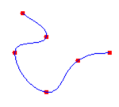

# cardinal-spline

A cardinal spline is a sequence of individual curves joined to form a larger curve. The spline is specified by an array of points and a tension parameter. A cardinal spline passes smoothly through each point in the array; there are no sharp corners and no abrupt changes in the tightness of the curve. The following illustration shows a set of points and a cardinal spline that passes through each point in the set.





## Install
[](https://nodei.co/npm/cardinal-spline/)

`npm install cardinal-spline`

or with bower:

`bower install cardinal-spline`


## Use


```js
var cSpline = require('cardinal-spline');

var splinePoints = cSpline(points[, tension, numOfSeg, close]);
//-> splinePoints is a flat Float32Array, [x1, y1, x2, y2, ..., xn, yn]

```

### Options

```js
/**
* @param {Array} points - (flat) point array: [x1, y1, x2, y2, ..., xn, yn]
* @param {Number} [tension=0.5] - tension. Typically between [0.0, 1.0] but can be exceeded
* @param {Number} [numOfSeg=25] - number of segments between two points (line resolution)
* @param {Boolean} [close=false] - Close the ends making the line continuous
* @returns {Float32Array} - the spline points.
*/
```

#### tension

The formulas for mathematical splines are based on the properties of flexible rods, so the curves produced by mathematical splines are similar to the curves that were once produced by physical splines. Just as physical splines of different tension will produce different curves through a given set of points, mathematical splines with different values for the tension parameter will produce different curves through a given set of points. 

A tension of 0 corresponds to infinite physical tension, forcing the curve to take the shortest way (straight lines) between points. A tension of 1 corresponds to no physical tension, allowing the spline to take the path of least total bend. With tension values greater than 1, the curve behaves like a compressed spring, pushed to take a longer path.


## License

MIT
